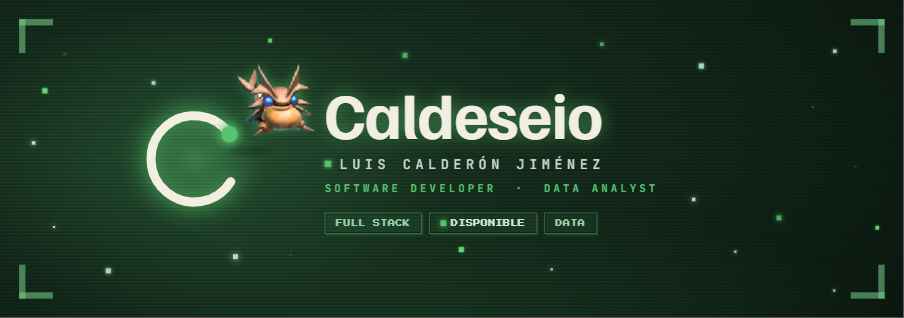
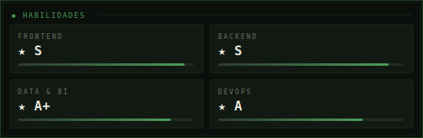

<!--
  CONFIGURACIÓN — edita estos valores para personalizar el README
  GH_USER   : Caldeseio            ← nombre de usuario GitHub (2 apariciones en ◆ ACTIVIDAD)
  LI_USER   : luis-calderon-962a57258  ← ID de perfil LinkedIn
  EMAIL     : l.calderon@uempresarial.com
  PORTFOLIO : caldeseio.dev
-->

  

 

### Luis Calderón Jiménez
`Software Developer · Data Analyst`

*Ingeniería precisa, hecha con criterio propio.*

 

&nbsp;

&nbsp;

---

 

**`◆ STACK TÉCNICO`**

---

**`◆ PROYECTOS`**

<table>
<tr>
<td width="33%" valign="top">

**`[ PROYECTO 1 ]`**

> Descripción breve del proyecto y qué problema resuelve.

[Ver repo →](https://github.com/Caldeseio)

</td>
<td width="33%" valign="top">

**`[ PROYECTO 2 ]`**

> Descripción breve del proyecto y qué problema resuelve.

[Ver repo →](https://github.com/Caldeseio)

</td>
<td width="33%" valign="top">

**`[ PROYECTO 3 ]`**

> Descripción breve del proyecto y qué problema resuelve.

[Ver repo →](https://github.com/Caldeseio)

</td>
</tr>
</table>

---

   
  
    
  
  &nbsp;·&nbsp;
  
    
  <code>CALDESEIO · LUIS CALDERÓN JIMÉNEZ · 2026</code>

